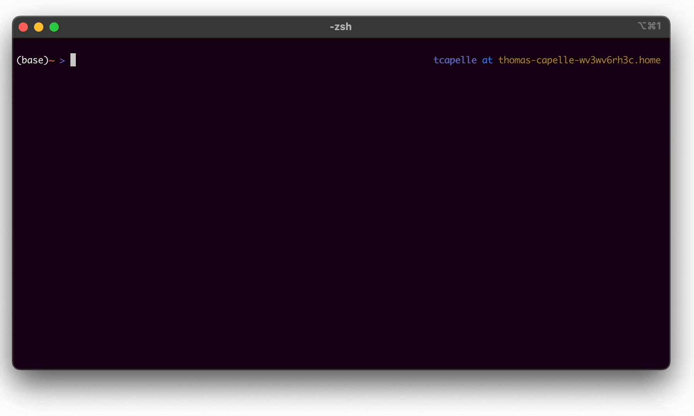

[](https://badge.fury.io/py/termgpt)

# termGPT: OpenAI Chatbot in the Terminal



TermGPT v1.0.0 introduces exciting new features including improved conversation history management and experimental function-calling support for executing Linux commands from your terminal. This program uses the OpenAI API to create a chatbot that can converse with users. The chatbot is powered by advanced language models and can answer a wide range of questions. If you are like me and want to stay in the terminal, this is the tool for you.

## Breaking Change: Now you can use the `llm` command

Previous versions supported separate commands like `gpt3`, `gpt4`, or `claude`. In this version, these have been consolidated into a single entry point:

```bash
$ llm
```

Beware that using advanced models (like gpt-4o) might be more expensive than previous versions, so use them with care.

## Install
You will need an OpenAI API key, which should be available as an environment variable named `OPENAI_API_KEY`.

```bash
$ pip install termgpt
```

## Usage

**Interactive Chat:**

```bash
$ llm
> who are you?

I am an AI language model created by OpenAI. My purpose is to assist and respond to your queries to the best of my abilities.
```

**Resume Previous Conversation:**

TermGPT now keeps track of your conversation in `chatgpt_history.json`, so you can resume a previous session with the `-r` flag.

```bash
$ llm -r
--Resuming previous session--
[System] You are a helpful assistant.

> what is relu
ReLU (Rectified Linear Unit) is an activation function commonly used in deep neural networks...
> and gelu?
GeLU (Gaussian Error Linear Unit) is another activation function used in deep neural networks...
```

**Run Terminal Commands (Experimental):**

You can now execute terminal commands via natural language using the `-c` flag. **Use at your own risk!**

```bash
$ llm -c "list all files in this folder with sizes"
ls -lh
total 40
-rw-r--r--  1 user staff   2.4K Mar 6 09:43 README.md
...
```

**Save Output:**

Store the session output in a plain text file with the `-o` flag.

```bash
$ llm -o "poem.txt"
> Can you write a short poem about chatbots, guacamole and cars?

Chatbots beep and bloop,
Serving customers with ease,
Guac and chips in hand.

Cars race on, onwards,
As chatbots assist the ride,
Dipping chips divine.

Time taken: 2.27 seconds
Saving history to chatgpt_history.json, you can restore this session with `-r`
Saving output to poem.txt
```

## Additional Notes
- The conversation history is maintained in `chatgpt_history.json`, allowing you to resume previous sessions at any time.
- Experimental function calling support has been implemented to help generate and execute Linux commands based on your prompts.
- TermGPT v1.0.0 consolidates previous multiple commands into a unified `llm` interface, designed for simplicity and enhanced usability.

Happy chatting!

